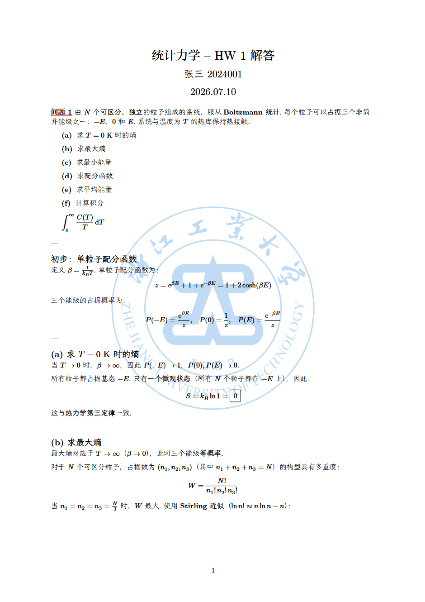
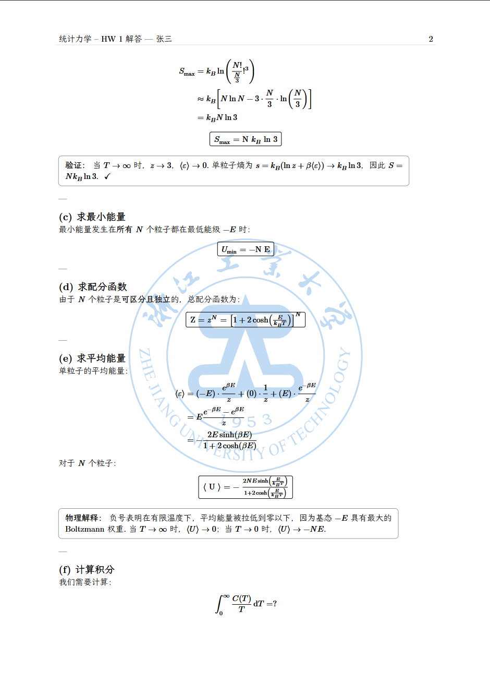
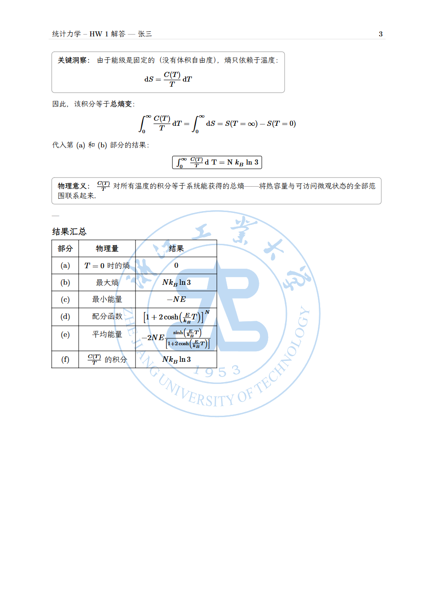

# ZJUT Physics Homework

浙江工业大学物理作业/练习解答模板，支持 (a)(b)(c) 子题编号和物理常数。

## 特点

- 支持中英文
- 支持 (a)(b)(c) 格式的子题编号（`sub-problem` 组件）
- 标题可选显示（`show-title` 参数）
- 内置常用物理常数（光速、普朗克常数、玻尔兹曼常数等）
- 每道题中的行间公式自动编号，可直接引用
- `boxed()` 函数给重要公式加方框

适用于提交 问题-解答 类型的物理作业或练习。

## 预览

可参考仓库中的 `template/hw.typ` 和 `template/hw-en.typ` 文件。

|1|2|3|
|:-:|:-:|:-:|
||||

## 使用

### 基本用法

```typst
#import "@preview/zjut-phy-hwk:0.2.0": *
#set text(lang: "zh")
#show: hwk.with(author: "张三", course: [力学], hwk-id: 1, stu-id: 2024001)

#problem[
  一质量为 $m$ 的物体从高度 $h$ 处自由落下，忽略空气阻力。
  #sub-problem[求物体落地时的速度]
  #sub-problem[求物体落地所用时间]
]

#solution[
  #sub-problem[由机械能守恒 $m g h = frac(1,2) m v^2$，得 $v = sqrt(2 g h)$]
  #sub-problem[由 $h = frac(1,2) g t^2$，得 $t = sqrt(2 h / g)$]
]
```

### 物理常数

```typst
#import "../lib.typ": *

$ E = h nu $          // 普朗克常数
$ E = m c^2 $         // 光速
$ F = G (m_1 m_2) / r^2 $  // 引力常数
$ chevron.l epsilon chevron.r = k_B T $  // 玻尔兹曼常数
```

可用的物理常数：`c`, `h`, `hbar`, `e`, `k_B`, `G`, `epsilon_0`, `mu_0`, `m_e`, `m_p`, `m_n`, `alpha`, `N_A`, `R`, `sigma`, `b`, `a_0`, `R_infty`, `mu_N`, `mu_B`

### 标题可选显示

```typst
#problem[题目内容]           // 显示 "问题 1" 标题
#problem(show-title: false)[题目内容]  // 不显示标题

#solution[解答内容]          // 显示 "解答" 标题
#solution(show-title: false)[解答内容] // 不显示标题
```

## 字体

需要安装以下字体：

```typst
#let needed-font = (
    "Source Han Serif SC",  // 标题（中文）
    "LXGW WenKai",          // 正文（中文）
    "New Computer Modern",  // 英文/公式
)
```

---

# Physics Homework Template

A homework/solution template for physics courses at ZJUT, supporting (a)(b)(c) sub-problem numbering and physics constants.

## Features

- Supports both Chinese and English
- (a)(b)(c) sub-problem numbering via `sub-problem` component
- Optional title display (`show-title` parameter)
- Built-in physics constants (speed of light, Planck constant, Boltzmann constant, etc.)
- Auto-numbered display equations with cross-references
- `boxed()` function for highlighting key results

## Usage

```typst
#import "@preview/zjut-phy-hwk:0.2.0": *
#set text(lang: "en")
#show: hwk.with(author: "John", course: [Mechanics], hwk-id: 1, stu-id: 2024001)

#problem[
  A particle of mass $m$ is dropped from height $h$.
  #sub-problem[Find the velocity upon impact]
  #sub-problem[Find the time of fall]
]

#solution[
  #sub-problem[By energy conservation: $v = sqrt(2 g h)$]
  #sub-problem[From $h = frac(1,2) g t^2$: $t = sqrt(2 h / g)$]
]
```

## Physics Constants

```typst
$ E = h nu $                    // Planck constant
$ E = m c^2 $                   // Speed of light
$ F = G (m_1 m_2) / r^2 $      // Gravitational constant
$ chevron.l epsilon chevron.r = k_B T $  // Boltzmann constant
```

Available: `c`, `h`, `hbar`, `e`, `k_B`, `G`, `epsilon_0`, `mu_0`, `m_e`, `m_p`, `m_n`, `alpha`, `N_A`, `R`, `sigma`, `b`, `a_0`, `R_infty`, `mu_N`, `mu_B`

## Fonts

```typst
#let needed-font = (
    "Source Han Serif SC",  // Titles (Chinese)
    "LXGW WenKai",          // Body (Chinese)
    "New Computer Modern",  // English/Math
)
```
